# Leaflet

An artistic, single-piece digital publication builder for writers. Pure
typography, Cargo-style. **One piece of writing → one dedicated URL.**

Built with Stripe Projects (Auth0 + Neon + Vercel) on Next.js.

### → [**leaflet-puce.vercel.app**](https://leaflet-puce.vercel.app)

[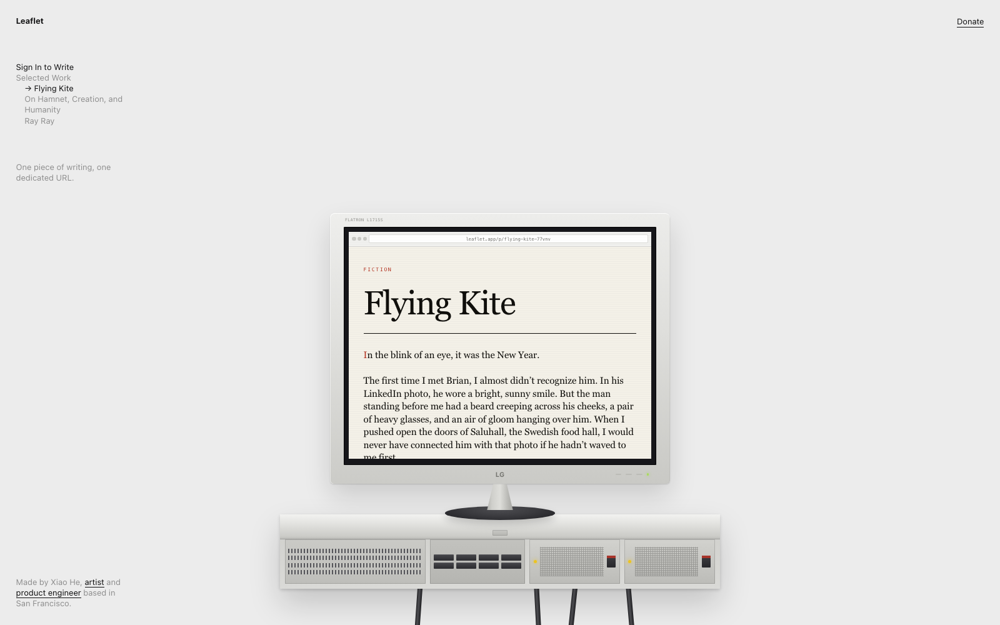](https://leaflet-puce.vercel.app)

### Selected work

Writing by [Xiao He](https://www.xiaohe.studio/about). Pick one from the
landing page's menu and it renders on the monitor in place — scroll it there,
or click the URL bar to open the real page.

- [Flying Kite](https://leaflet-puce.vercel.app/p/flying-kite-77vnv) — fiction, **broadsheet**
- [On Hamnet, Creation, and Humanity](https://leaflet-puce.vercel.app/p/on-hamnet-creation-and-humanity-aq75f) — review, **verse**
- [Ray Ray](https://leaflet-puce.vercel.app/p/ray-ray-6dh94) — review, **reader**

---

## The demo, in 60 seconds

1. Land on `/` → **Sign in to write** (Auth0).
2. `/write` — paste a poem, pick **Verse**, watch the live preview redraw.
3. **Publish** → congrats screen with the live URL.
4. Open `/p/<slug>` — the piece, full screen, nothing else on the page.

### The loop, in screenshots

**Write.** The preview on the right is the real template component, not a
mock-up. Switching the radio redraws it instantly.

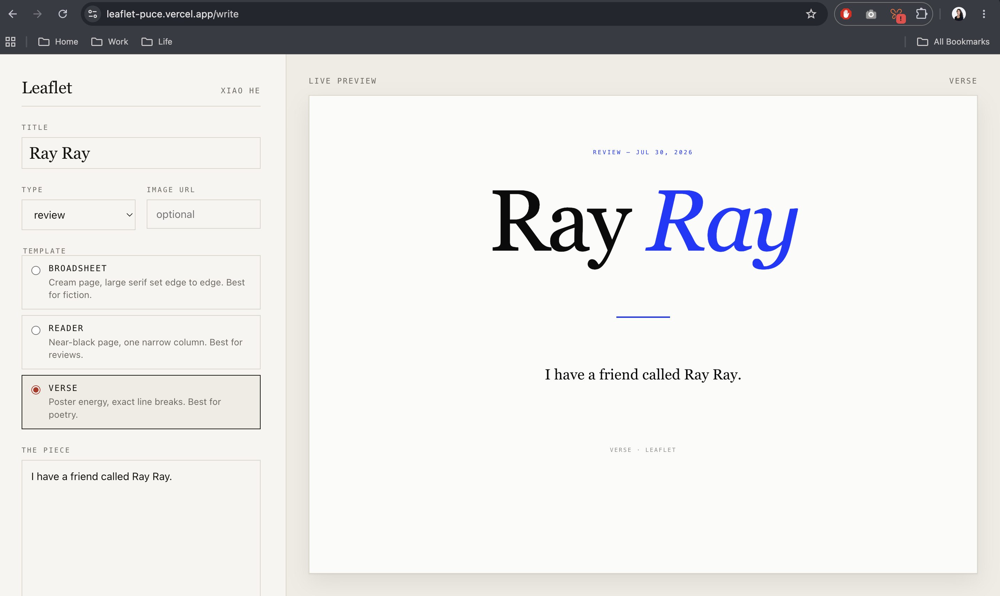

Same piece, a different template, with the optional image URL filled in:

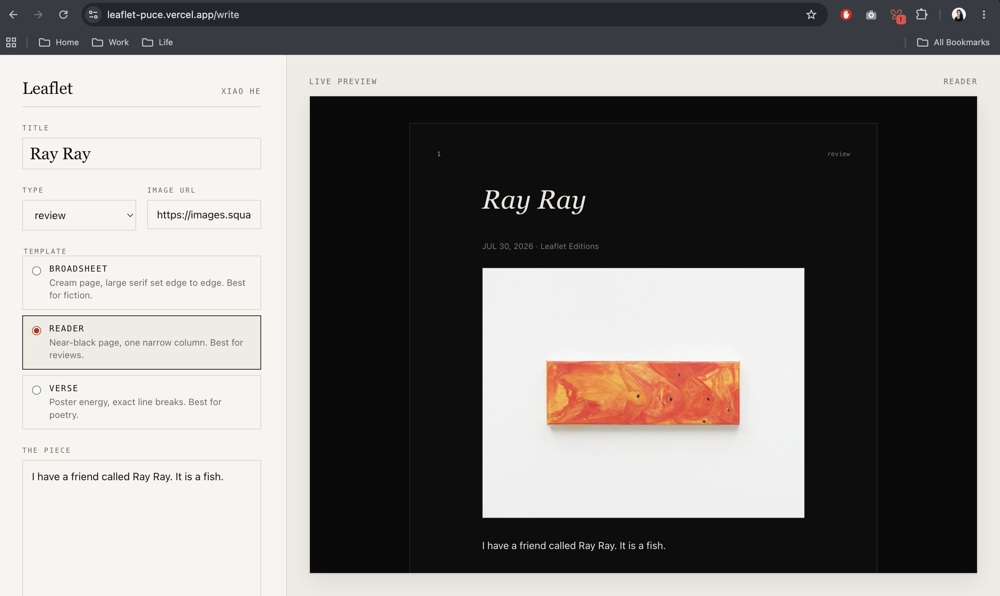

A long poem, set as continuous text with indented first lines:

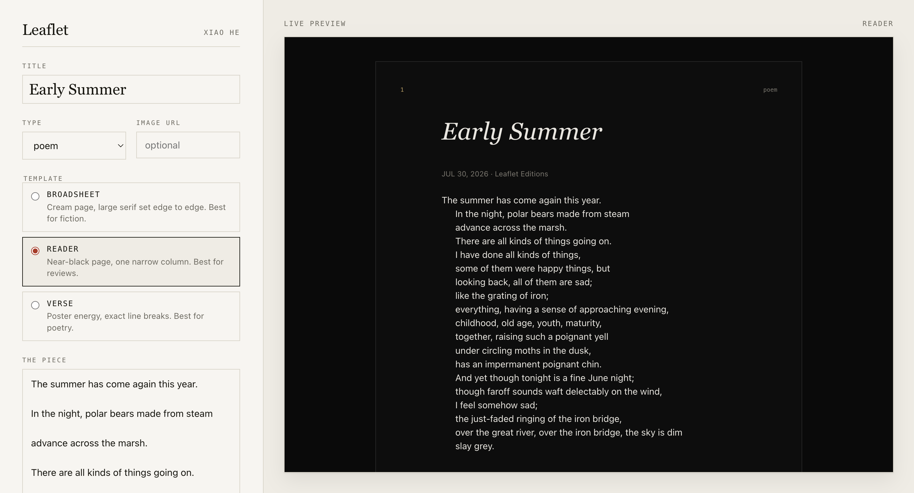

**Publish.** The slug comes from the title plus a short random suffix, so two
pieces can share a title.

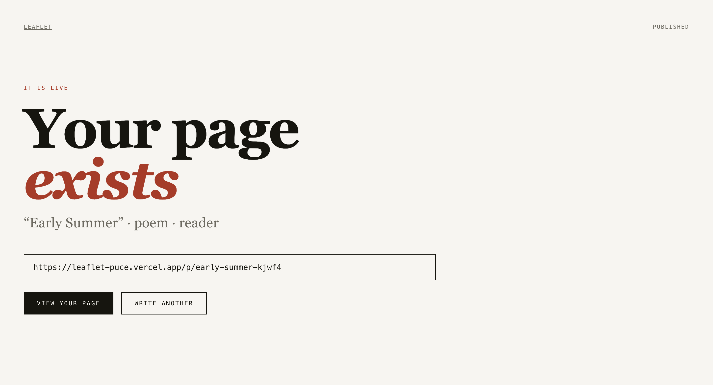

**The page.** Public, no auth, nothing on it but the piece.

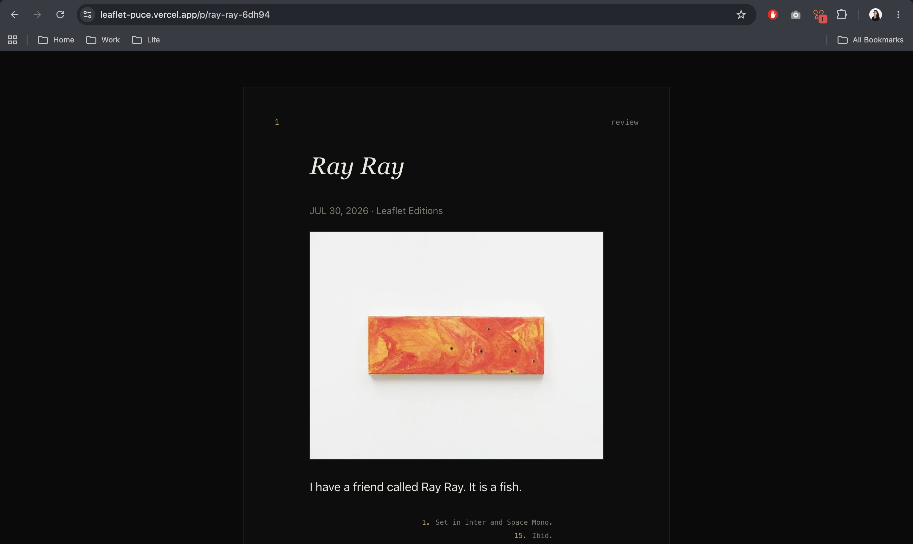

Each template previewed side by side:

| verse | broadsheet | reader |
|---|---|---|
| 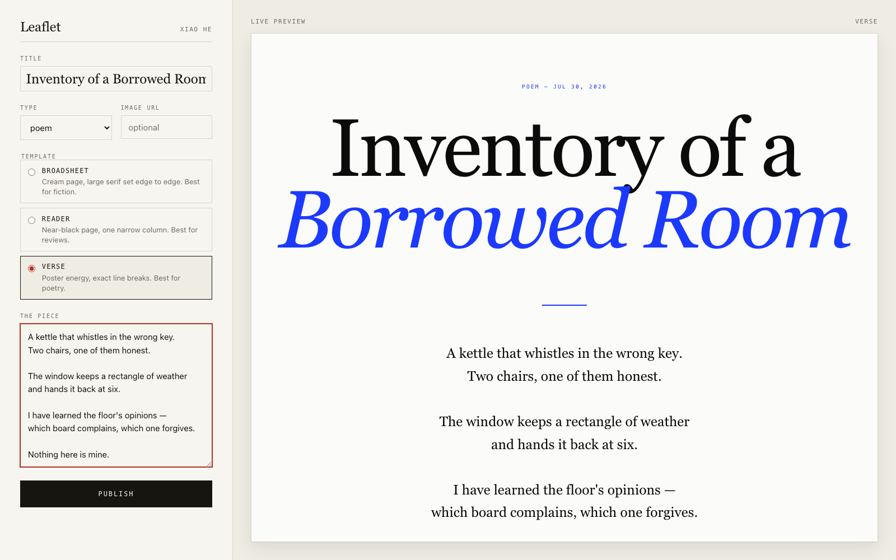 | 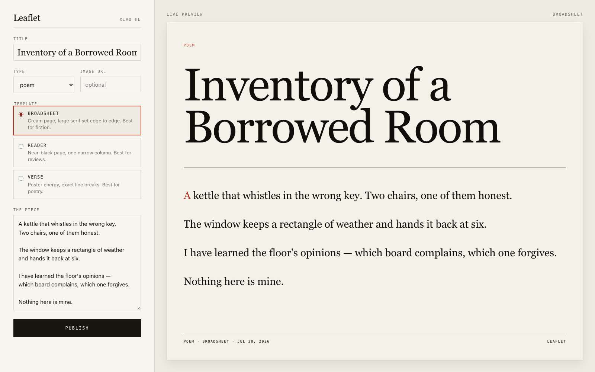 | 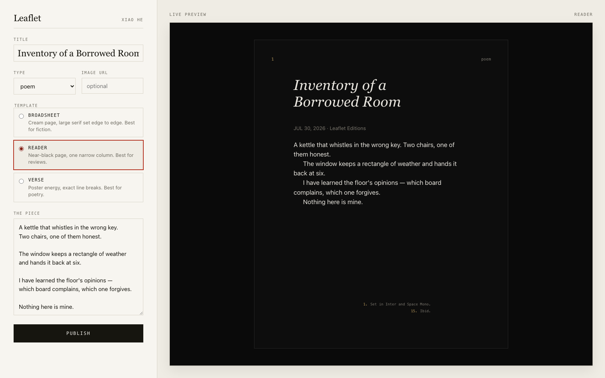 |

### Design references

The type system was drawn against these — the metadata row under the image on
[sam-evers.com](https://sam-evers.com), and the mono-caption voice of
[andrescasas.cl](https://andrescasas.cl):

| sam-evers.com | andrescasas.cl |
|---|---|
| 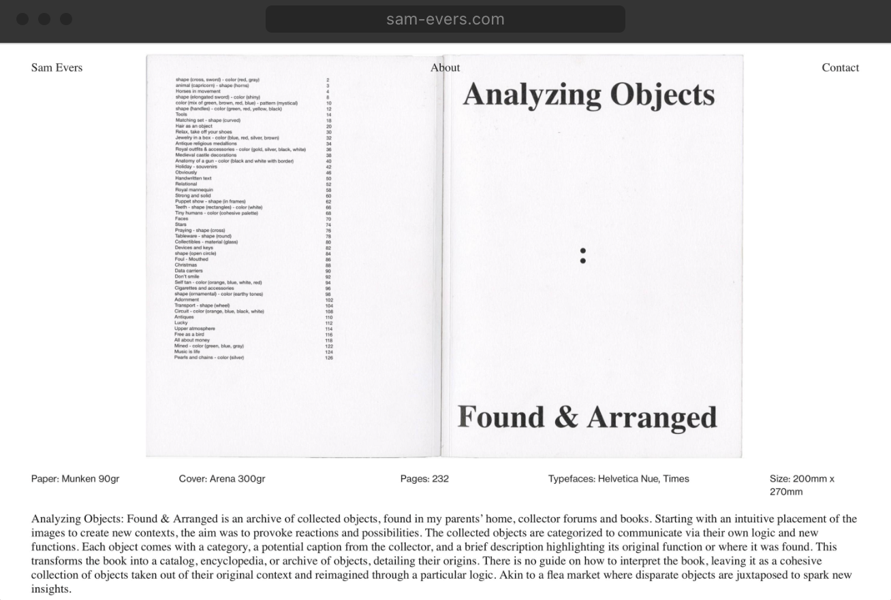 |  |

*Reference screenshots, credited to their authors — the moodboard this was
built against, not anything belonging to this project.*

---

## What it is

One Next.js app on Vercel. Every published piece gets its own public URL via
the dynamic route `/p/[slug]`. Each piece is still its own "site" — own URL,
own template, nothing else on the page.

**In the MVP:** Auth0 login, Neon Postgres, an editor with a live preview,
three typographic templates, publish → live URL.

**Deliberately cut (the "next steps" slide):** a separate Vercel deploy per
piece, image file upload (URL field only), colour/font customisation,
AI-generated templates.

## Routes

| Route | Auth | What |
|---|---|---|
| `/` | public | Landing. |
| `/write` | gated | Editor: title, type, template, body, optional image URL + live preview. |
| `/published/[slug]` | public | Congrats screen with the live URL. |
| `/p/[slug]` | **public** | The piece, full screen. This page is the product. |
| `/auth/login`, `/auth/logout`, `/auth/callback` | — | Mounted by the Auth0 SDK middleware. |

---

## Running it locally

```bash
git clone https://github.com/hexiao0225/leaflet.git
cd leaflet
npm install
stripe projects env --pull    # writes .env
npm run dev                   # http://localhost:3000
```

See [`.env.example`](./.env.example) for the variables involved. Without `.env`
the app still boots — the landing page renders and tells you what is missing,
which is what let it go live on Vercel in the first half hour.

Create the one table by running [`schema.sql`](./schema.sql) against your
database, then seed the demo pieces:

```bash
node scripts/seed.mjs         # safe to re-run
```

To open the editor without Auth0 (break-glass for a demo), set:

```bash
LEAFLET_DEMO_USER="Your Name"
```

### Deploying

`main` is connected to the Stripe-provisioned Vercel project, so **every push
redeploys**. There is no separate deploy step.

```bash
git push origin main                            # production deploy
vercel deploy --prod --token "$VERCEL_TOKEN"    # manual, same target
```

---

## Stripe Projects CLI reference

```bash
# Install Stripe CLI
brew install stripe/cli

# Install + init the Projects plugin
stripe plugin install projects
stripe plugin init
stripe projects init          # writes .env, .gitignore, settings, cloud skills

# Add services (writes credentials into .env)
stripe projects add auth0/client      # AUTH0_* env vars
stripe projects add neon/postgres     # NEON_POSTGRES_* env vars
stripe projects add vercel/project    # VERCEL_TOKEN + project
```

Providers available include Vercel, Auth0, Neon, Agentmail, BrowserBase,
ElevenLabs. For anything not listed, use its API directly and set env vars.

Provisioning Neon, straight after Auth0 wrote its three credentials into `.env`
and the vault:

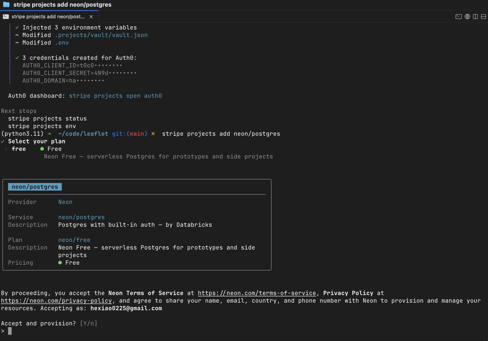

### Four things the CLI does not do for you

Provisioning the three services is not quite enough to make the app work. In
order:

**1. Auth0 v4 needs two vars Stripe does not write.** `AUTH0_SECRET` (session
encryption) and `APP_BASE_URL`. Store them as project variables so they land in
`.env` on every pull:

```bash
stripe projects variables set auth0-secret  --env-key AUTH0_SECRET  --value "$(openssl rand -hex 32)"
stripe projects variables set app-base-url  --env-key APP_BASE_URL  --value "https://leaflet-puce.vercel.app"
stripe projects env --pull
```

**2. The database URL is called something else.** Stripe writes
`NEON_POSTGRES_CONNECTION_STRING`, not `DATABASE_URL`. `lib/db.ts` accepts
either.

**3. Auth0 callback URLs are not registered.** Out of the box a deployed login
fails with **Callback URL mismatch**. Fix it through the CLI, not the dashboard:

```bash
stripe projects update auth0-client auth0/client --config '{
  "callbacks":          ["https://leaflet-puce.vercel.app/auth/callback", "http://localhost:3000/auth/callback"],
  "allowed_logout_urls":["https://leaflet-puce.vercel.app", "http://localhost:3000"],
  "web_origins":        ["https://leaflet-puce.vercel.app", "http://localhost:3000"]
}' -y
```

This does **not** rotate the client credentials, so no redeploy is needed for
the secret — only for the URLs.

**4. The provisioned Vercel project is empty.** It has no deployment, no
framework, and no git connection. Push the env vars to it, link it to the repo
so pushes redeploy, and deploy:

```bash
vercel deploy --prod --token "$VERCEL_TOKEN"
```

### Plumbing notes

**Auth0** — `@auth0/nextjs-auth0` v4. The SDK's `Auth0Client` is constructed
lazily in [`lib/auth0.ts`](./lib/auth0.ts) so the public half of the app boots
before the `AUTH0_*` vars exist. `middleware.ts` mounts `/auth/login`,
`/auth/logout` and `/auth/callback`; login and logout are plain links. Nothing
hand-rolled.

**Neon** — `@neondatabase/serverless` against the connection string. All reads
and writes live in server actions / server components
([`lib/db.ts`](./lib/db.ts)).

**Vercel** — the Stripe-provisioned Vercel project (`hexiao0225-stripe/leaflet`)
is connected to this GitHub repo, so every push to `main` redeploys. Deploys use
the `VERCEL_TOKEN` that Stripe Projects wrote.

---

## Project layout

```
app/
  page.tsx                 landing — the workstation
  page.module.css          landing only
  shell.module.css         chrome shared by /write's gate and the 404
  write/                   editor (client) + publish server action
  published/[slug]/        congrats screen with the live URL
  p/[slug]/                the public piece — the product
  fonts.ts, globals.css    type stack + app chrome
components/
  Workstation.tsx          the CSS-drawn LCD; children render on the glass
  templates/               one component + one CSS module each
lib/
  auth0.ts  db.ts  slug.ts  format.ts  types.ts
scripts/seed.mjs           seeds the demo pieces
schema.sql                 the one table
```

## Credits

The writing in `scripts/seed.mjs` is original, included as demo content. The
reference screenshots in `docs/ref-*.png` belong to the sites credited above
and are included only as the moodboard this design was built against.
